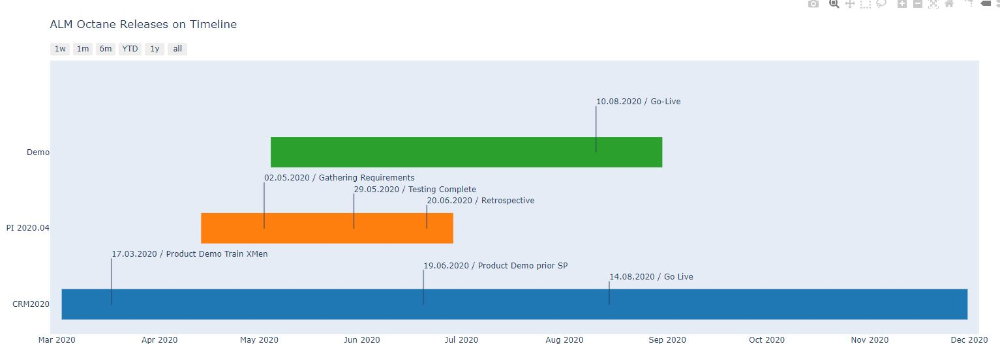
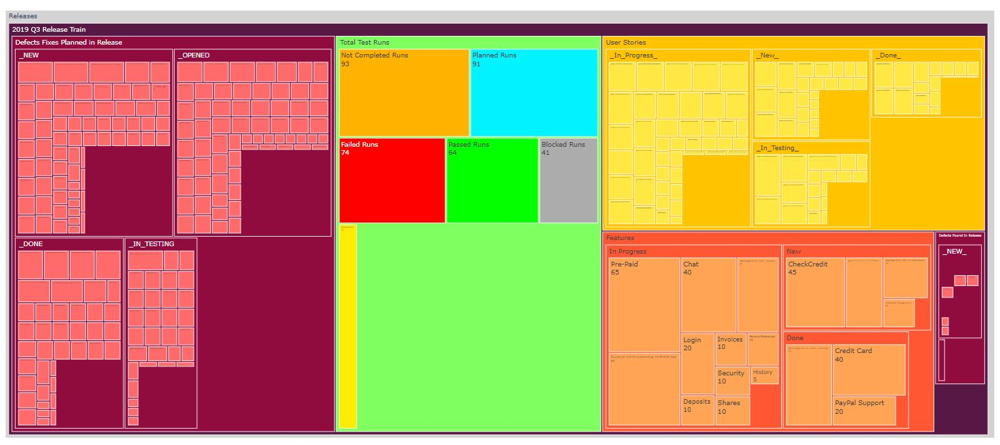
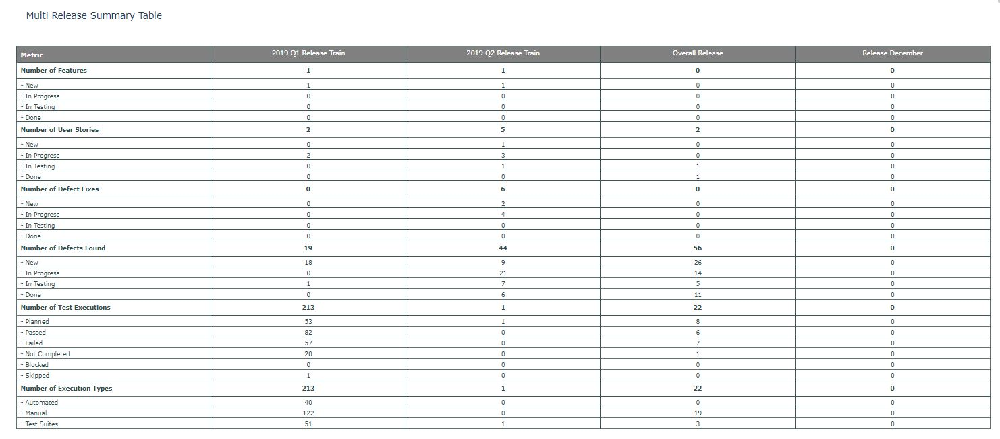
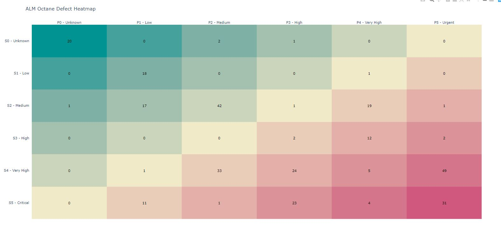
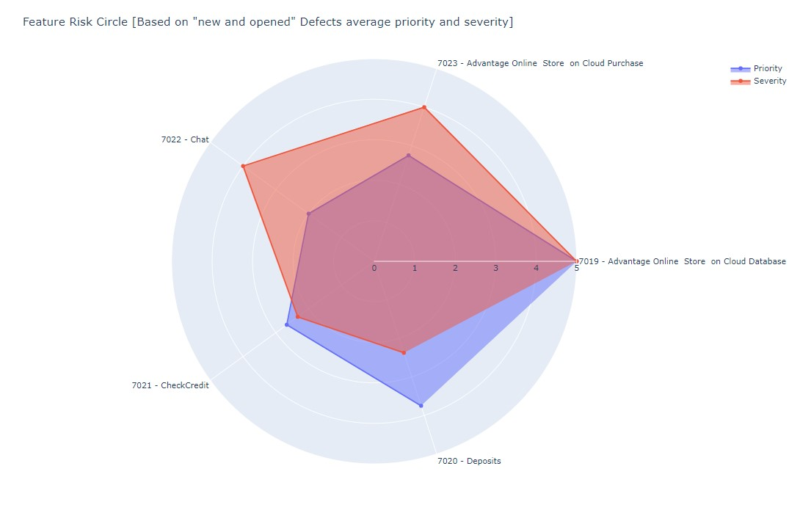

# Examples for ALM Octane REST API with Python
This repository provides example for python using ALM Octane REST API.

# BASICS
The Basics package contains a set of package to help connecting to ALM Octane using the REST API and reading, creating, changing or deleting entities (such as defects, tests, requirements, etc.)

_**Requirements**_
- Installation of Pyhton IDE, in this article PyCharm (Community Edition) is used.
- Download and Install Python, https://www.python.org/downloads/
- Install requests: pip install requests, https://pypi.org/project/requests/
- Install json: https://docs.python.org/3/library/json.html
- Generate Client Id and Client Secret for ALM Octane: https://admhelp.microfocus.com/octane/en/latest/Online/Content/AdminGuide/how_setup_APIaccess.htm- Install Flask: pip install Flask, https://pypi.org/project/Flask/

**BASICS.Authentication package**
The Authentication package contains examples on how to sign_in to and sign_out from ALM Octane. There are 2 files:
.Login and logout.py - flat example on how to connect and disconnect to / from the ALM Octane REST API
.Authenticationfunctions.py - contains the sign_in and sign_out as functions to be used in other scripts

**BASICS.defects**
The defects package contains examples on how to work with defects when using the ALM Octane REST API, i.e. Create one or more defects, read all defects, etc.

**BASICS.tests**
The tests package contains examples on how to work with tests when using the ALM Octane REST API, i.e. Create a manual test, add steps to the manual test, etc.

# External Actions
In this package, you will find alot of external actions to demonstrate the capabilities of ALM Octanes REST API combined with Python & Plotly and some other python library.

**External Actions.Release Reporting.Release Reporting.py**

_**Requirements**_
- Installation of Pyhton IDE, in this article PyCharm (Community Edition) is used.
- Download and Install Python, https://www.python.org/downloads/
- Install Flask: pip install Flask, https://pypi.org/project/Flask/
- Install Plotly: pip install plotly, https://pypi.org/project/plotly/
- Install requests: pip install requests, https://pypi.org/project/requests/
- Install json: https://docs.python.org/3/library/json.html
- Generate Client Id and Client Secret for ALM Octane: https://admhelp.microfocus.com/octane/en/latest/Online/Content/AdminGuide/how_setup_APIaccess.htm- Install Flask: pip install Flask, https://pypi.org/project/Flask/

**[RELEASE REPORTING]**

_**Releases on Timeline**_
This report generates a gannt chart and put all selected relation from ALM Octane UI on that gantt chart. The action (button for the external action editor: https://admhelp.microfocus.com/octane/en/15.0.40/Online/Content/AdminGuide/custom-buttons.htm), you can find in **External Actions.Release Reporting.external-actions-editor-json**. Just copy the content to you ALM Octane External Action Editor.

See this External Action in a short demo: https://youtu.be/3X7Tef9fgB8
external-action-name: releases-overview

_**Release Summary Treemap**_
This report generates a treemap on a single release to provide a summary on the content of a release. The action (button for the external action editor: https://admhelp.microfocus.com/octane/en/15.0.40/Online/Content/AdminGuide/custom-buttons.htm), you can find in **External Actions.Release Reporting.external-actions-editor-json**. Just copy the content to you ALM Octane External Action Editor.

See this External Action in a short demo: https://youtu.be/wgapDDCmGjs
external-action-name: release-summary

_**Release Summary Table**_
This report generates a summary table for multiple releases to provide a summary on the content of each release. The action (button for the external action editor: https://admhelp.microfocus.com/octane/en/15.0.40/Online/Content/AdminGuide/custom-buttons.htm), you can find in **External Actions.Release Reporting.external-actions-editor-json**. Just copy the content to you ALM Octane External Action Editor.

See this External Action in a short demo: https://youtu.be/Q1EBkmvzAiQ
external-action-name: release-summary-table

**[DEFECT REPORTING]**

_**Defect Heatmap**_
This report generates a heatmap for the selected ALM Octane defects. It also applies automatically the filter chosen for this heatmap, i.e. If you want to see the heatmap for a specific release, you can set the filter in ALM Octane and select all defect to generate this heatmap. The action (button for the external action editor: https://admhelp.microfocus.com/octane/en/15.0.40/Online/Content/AdminGuide/custom-buttons.htm), you can find in **External Actions.Defect Reporting.external-actions-editor-json**. Just copy the content to you ALM Octane External Action Editor.

See this External Action in a short demo: https://youtu.be/18ryPIx_fF4
external-action-name: defect-heatmap

**[FEATURE REPORTING]**

_**Risky Features Circle**_
This report generates a circle showing the risk for selectedALM Octane features. It also applies automatically the filter chosen for this circle, i.e. If you want to see the circle for a specific release or an epic, you can set the filter in ALM Octane and select all features to generate this circle. The action (button for the external action editor: https://admhelp.microfocus.com/octane/en/15.0.40/Online/Content/AdminGuide/custom-buttons.htm), you can find in **External Actions.Defect Reporting.external-actions-editor-json**. Just copy the content to you ALM Octane External Action Editor.

See this External Action in a short demo: https://youtu.be/SY07Yf6N8E4
external-action-name: risky-features

**[TEST DATA USAGE REPORTING]**
This report generates a HTML report with shows the usage of the test datatable's datasets in different tests and runs. This can be useful in order to understand which tests are using the diferent datasets and if there are datasets not used at all.

See this External Action in a short demo: 
external-action-name: test-data-usage

(more to come... stay tuned...)